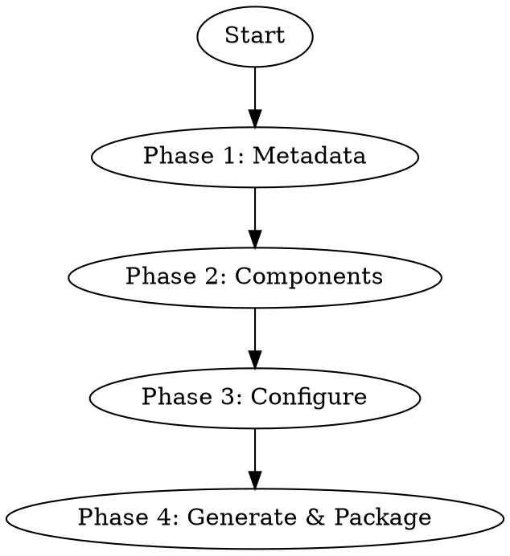

# plugin-create

Interactive Q&A wizard to build a spec-compliant Plugin from scratch, outputting a ZIP package.

**References (read on demand):**
- [Plugin Spec](references/spec.md) — plugin.json + SubAgent + CLI + i18n + Resources
- [Skill Guide](references/skill-guide.md) — Skill templates + writing tips + full examples

---

## Flow Overview



---

## Phase 1: Collect Plugin Metadata

Ask ONE question at a time. Use plain language. Handle technical formatting automatically.

**Step 1 (Required):**
SAY: "What do you want this plugin to do? For example: 'Help the Agent query our company FAQ', 'Automate the weekly report process', 'Connect to our internal HR system'."

**Step 2 (Required):**
Based on user's description, suggest a name:
SAY: "Based on what you described, I suggest calling it '[suggested-name]'. Does that work, or would you prefer a different name?"

Agent-internal: auto-generate kebab-case `name` from suggestion (e.g. "Company FAQ Helper" → `company-faq-helper`). Use user-facing name as `displayName`.

**Step 3 (Recommended):**
> "What category does it belong to? For example: 'knowledge', 'finance', 'hr', 'devops', 'marketing'. You can type anything."

**Step 4 (Optional — offer to skip all at once):**
> "A few optional details — feel free to skip any:
> - Version number? (default: 0.1.0)
> - Author name?
> - Icon? (can be an emoji like 🔧 or an image file)
> - Tags? (keywords for search, e.g. 'faq, docs, search')"

If user says "skip" or "default" → use defaults for all optional fields and move to Phase 2.

---

## Phase 2: Choose Components

Explain to user in plain language, then let them pick:

> "A plugin can contain different types of capabilities. Let me explain the options:
>
> **A. Knowledge / Workflow only** — You have documents, rules, or step-by-step guides that you want the Agent to follow. This is the simplest form.
>
> **B. Knowledge + Command-line tool** — In addition to guides, your plugin also ships a CLI tool that the Agent can execute.
>
> **C. Full plugin** — Includes knowledge, CLI tools, AND specialist sub-Agents that can be dispatched for complex sub-tasks.
>
> Which one fits your needs? Or describe what you want and I'll recommend."

### Mapping user choice to components

| User choice | Components created | Phase 3 sections to run |
|---|---|---|
| A (knowledge only) | plugin.json + skills/ | 3.1 + 3.4 (resources optional) |
| B (knowledge + CLI) | + clis/ + resources/ | 3.1 + 3.3 + 3.4 |
| C (full) | + subagents/ + prompt.md | 3.1 + 3.2 + 3.3 + 3.4 + 3.5 |

If user is unsure, recommend A (simplest) and explain they can add more later.

See [skill-guide.md](references/skill-guide.md) for full template examples.

Then ask:
> "Where should I generate the plugin files? (default: current directory)"

---

## Phase 3: Configure Each Component

> Convention: Lines starting with `SAY:` are user-facing (plain language, no jargon). Everything else is Agent-internal instruction.

### 3.1 Configure Skills

SAY: "Do you already have skill files prepared? You can provide a file, paste the content, or drag in a ZIP package. If you don't have anything yet, I can help you create one."

Repeat for each Skill. After each one:
SAY: "Got it. Do you have another skill to add, or shall we move on?"

#### Path A: User provides a ZIP package

Agent-internal processing:
1. Extract ZIP to temp directory
2. Scan for SKILL.md files (may be at root or in subdirectories)
3. For each SKILL.md found:
   - Validate frontmatter (name + description required)
   - Determine directory name: use parent folder name if already kebab-case, otherwise generate from `name` field
   - Preserve the ENTIRE directory contents alongside SKILL.md: display.txt, references/*.md, scripts/, images, any supporting files
4. Place each complete skill directory into `skills/{name}/` (maintaining internal structure)
5. Report findings to user:
   SAY: "I found [N] skill(s) in your ZIP: [list names]. I've verified their format — all look good. Shall we continue?"
   - If any skill has invalid frontmatter:
     SAY: "I found an issue with '[skill-name]' — it's missing [field]. Would you like me to fix it, or do you want to update it yourself?"

#### Path B: User provides a single file or pastes content

1. User provides file path or pastes content
2. Validate frontmatter (name + description required). Required format:
```yaml
---
name: skill-name
description: English description for LLM trigger matching
---
```
3. Auto-generate kebab-case directory name from `name` field
4. Place into `skills/{name}/SKILL.md`
5. SAY: "Would you like to add a short list of capabilities this skill provides? (This helps display it nicely in the UI)"
   - If yes → collect entries, generate `display.txt`

#### Path B: Guided creation (user says "I don't have one" / "help me" / "no")

**Step 1:**
SAY: "What should the Agent be able to do after installing this plugin? For example: 'Query our internal FAQ', 'Follow our deployment process', 'Know our pricing rules'."

**Step 2 — Agent determines type internally:**

| Type | Signal | Guidance Focus |
|---|---|---|
| Tool usage guide | User mentions calling tools/commands/APIs | Command format, examples, pitfalls |
| Workflow | User describes a multi-step process | Steps, conditions, failure recovery |
| Knowledge base | User describes rules/knowledge/policies | Rules, decision criteria, scope |

**Step 3 — Collect content (questions vary by type):**

If tool usage guide:
SAY:
> 1. "What tool or command should the Agent use?"
> 2. "Can you give 2-3 examples of common tasks?"
> 3. "What mistakes are easy to make?"
> 4. "Is there anything that needs to be set up first?"

If workflow:
SAY:
> 1. "Walk me through the steps — what's the process from start to finish?"
> 2. "Are there any steps where different situations need different actions?"
> 3. "What can go wrong, and how should the Agent recover?"
> 4. "Is there anything that needs to be ready before starting?"

If knowledge base:
SAY:
> 1. "What are the key rules or knowledge the Agent needs?"
> 2. "Are there situations where different rules apply? (like a decision table)"
> 3. "When should the Agent use this knowledge, and when should it NOT?"

**Step 4:** Auto-generate name, description, and tool_triggers from collected content.
SAY: "Here's the skill name and description I suggest: [show suggestion]. Does this look right?"

**Step 5:** Assemble complete SKILL.md, preview to user.
SAY: "Here's the full skill file I've created. Take a look — should I save it as-is, or would you like to adjust anything?"

> Reference for assembly: [skill-guide.md](references/skill-guide.md)

---

### 3.2 Configure SubAgents

SAY: "Now let's set up the specialist sub-Agents. Each one is like an expert assistant that can be called when needed."

Repeat for each. After each one:
SAY: "Got it. Add another specialist, or move on?"

Collect with these user-facing questions:
SAY:
> 1. "What should this specialist be called, and what's its job? (e.g. 'Listing Optimizer — rewrites product titles for better search ranking')"
> 2. "What instructions should it follow when working? (describe its behavior, rules, output format)"
> 3. "Should it have access to all the same tools as the main Agent, or only specific ones?"
> 4. "Does it need to read any of the skills we just created?"

Agent-internal processing:
- Answer 1 → extract `id` (kebab-case from name) + `description`
- Answer 2 → write to `subagents/{id}/prompt.md`
- Answer 3 → `"tools": "inherit"` or specific whitelist array
- Answer 4 → `skills` array with mode selection per [spec.md §2](references/spec.md)

Output structure:
```
subagents/{id}/
└── prompt.md
```

plugin.json declaration:
```json
{ "id": "sub-agent-id", "description": "...", "tools": "inherit" }
```

---

### 3.3 Configure CLI Tools

SAY: "Let's configure the command-line tools that ship with this plugin."

Repeat for each. After each one:
SAY: "Got it. Add another tool, or move on?"

Collect with these user-facing questions:
SAY:
> 1. "What's the tool called? (the command users type, e.g. 'my-tool')"
> 2. "What does it do in one sentence?"
> 3. "How is it installed? Is it an npm package, a pre-built binary, or a JS script inside the plugin?"
> 4. "Give a few usage examples (commands someone would actually run)."
> 5. "Should every Agent be able to use this tool, or only specific ones?"

Agent-internal processing:
- Answer 1 → `id`
- Answer 2 → `description`
- Answer 3 → `source` object (npm-package / bundled-binary / node-cli)
- Answer 4 → `usageExamples` array
- Answer 5 → `exposure`: "all-agents" or "declared-agents"

Output file `clis/clis.json`:
```json
{
  "tools": [
    { "id": "my-cli", "description": "...", "source": { "type": "npm-package", "packageName": "...", "binName": "..." } }
  ]
}
```

> Full field reference: [spec.md §3 CLI Tools](references/spec.md)

---

### 3.4 Configure Resources

**Icon:**

Based on user's answer from Phase 1:
- If emoji → write directly to plugin.json `"icon": "🔧"`
- If user provided/wants image → place in `resources/` (SVG recommended), plugin.json write `"icon": "icon.svg"`
- If user has no icon:
  SAY: "Would you like me to create a simple icon for you?"
  If yes → generate SVG, place in `resources/`

**Recommended prompts:**

SAY: "Would you like to show some suggested prompts to users on the homepage? These are quick-start examples they can click. For example: 'Check today's schedule', 'Create a new report'. Give me a few, grouped by topic."

If yes → collect sections + prompts, generate `resources/recommend.json`:
```json
[
  {
    "title": "Daily Operations",
    "prompts": [
      { "text": "Check today's schedule" },
      { "text": "Show pending tasks" }
    ]
  }
]
```

**Multi-language:**

SAY: "Does this plugin need to support multiple languages? If yes, what's the main language, and which other languages do you need?"

If yes → collect translations for plugin name/description and skill names, generate `resources/i18n.json`:
```json
{
  "version": "1.0",
  "defaultLocale": "zh",
  "entries": {
    "plugin.displayName": { "en": "English Name" },
    "plugin.description": { "en": "English description" },
    "skill.{skillId}.name": { "en": "..." },
    "skill.{skillId}.description": { "en": "..." }
  }
}
```

Note: defaultLocale content stays in source files; entries only contain OTHER languages.

> Full key naming rules: [spec.md §4 i18n](references/spec.md)

---

### 3.5 Configure System Prompt

SAY: "Finally — would you like to add a top-level instruction that tells Agents how to use this plugin? Think of it as a 'readme for the AI'. For example: which skill to use, what rules to follow, when to call the specialist sub-Agent."

If yes, collect with:
SAY:
> 1. "In a few sentences, how should an Agent use this plugin?"
> 2. "Any rules it must follow? (e.g. 'never call APIs directly, always use the CLI')"
> 3. "When should it hand off work to the specialist?" (only ask if SubAgents exist)

Generate `prompt.md` at plugin root.

Example output:
```markdown
You have access to the workspace-ops skill and ws-cli.
Use ws-cli for all calendar, task, and document operations.
Never call APIs directly — ws-cli handles authentication.
For complex optimization tasks, dispatch the listing-optimizer SubAgent.
```

---

## Phase 4: Generate & Package

### Generate files

**IMPORTANT: Before generating, read [spec.md](references/spec.md) to confirm exact field formats and structure rules.**

Build the full directory from collected information. Only generate directories for selected components.

**Core rules:**
- `plugin.json` — only write fields that have values
- `skills/` — auto-scanned, no need to list in plugin.json
- SubAgent — must satisfy dual confirmation: plugin.json declaration + physical directory
- CLI — use `clis/clis.json` (top-level field: `tools`), do not inline in plugin.json
- i18n — use entries format (not flat key-value)

**plugin.json minimal structure:**
```json
{
  "name": "{name}",
  "version": "{version}",
  "description": "{description}",
  "subAgents": []
}
```
Only include `subAgents` if SubAgents were configured. Only include optional fields (displayName, author, icon, category, tags) if user provided them.

### Validate (MANDATORY — do NOT skip)

**You MUST run validation before packaging. Do not proceed to ZIP without a passing result.**

Copy `scripts/validate-plugin.js` (from this skill's directory) to the output directory, then execute:

```bash
node validate-plugin.js ./{plugin-name}
```

If result is `✅ PASS` → proceed to Package.
If result is `❌ FAIL` → fix ALL listed errors, re-run validation until PASS. Do NOT package a failing plugin.

### Package

```bash
cd {output-dir}
zip -r {plugin-name}.zip {plugin-name}/ -x "*.DS_Store"
ABS_ZIP_PATH=$(cd "$(dirname {plugin-name}.zip)" && pwd)/{plugin-name}.zip
echo "$ABS_ZIP_PATH"
```

Capture the absolute path printed above — you will paste it into the artifact marker in the next step.

### Report to user

After packaging succeeds, your reply MUST contain a line with the artifact marker exactly in this shape (replace `{ABS_ZIP_PATH}` with the absolute path you captured above):

```
:::plugin-artifact[{ABS_ZIP_PATH}]
```

The host renders this line as an install-button card with `前往插件 Hub 上传` and `打开所在目录` actions. The line MUST stand on its own (preceded and followed by a blank line or by the message boundary), and MUST NOT be wrapped in a code fence or inline backticks — the parser only recognizes the bare directive.

You may say anything else around it (a short success headline, a brief summary). Free-form copy is welcome; the marker line is the only piece the protocol cares about.
