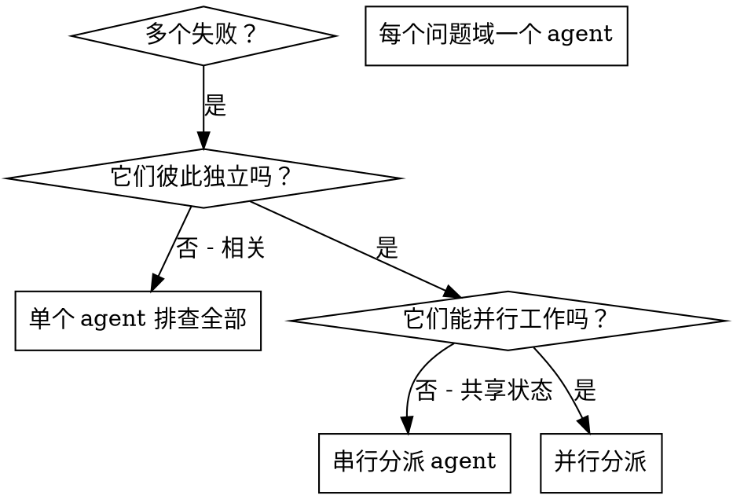

# 并行分派多个 Agent

## 概述

你把任务分派给具备隔离上下文的专职 agent。通过精确构造指令与上下文，你能确保它们保持专注并完成自己的任务。它们绝不应继承你会话的上下文或历史 —— 它们需要什么，就由你精确构造什么。这样做同时也为你自己保留了做协调工作的上下文。

当你有多个互不相关的失败（不同的测试文件、不同的子系统、不同的 bug）时，逐个串行排查纯属浪费时间。每项排查彼此独立，完全可以并行进行。

**核心原则：** 一个独立问题域分派一个 agent。让它们并发工作。

## 何时使用



**在以下情况使用：**
- 3 个以上测试文件失败，且根因各不相同
- 多个子系统各自独立地坏掉了
- 每个问题都能在不依赖其它问题上下文的情况下被理解
- 各项排查之间没有共享状态

**在以下情况不要使用：**
- 失败之间彼此相关（修好一个可能顺带修好别的）
- 需要理解整个系统的状态
- agent 之间会互相干扰

## 模式

### 1. 识别相互独立的域

按「坏的是什么」给失败分组：
- 文件 A 的测试：工具审批流程
- 文件 B 的测试：批次完成行为
- 文件 C 的测试：中止功能

每个域都是独立的 —— 修好工具审批不会影响中止测试。

### 2. 构造聚焦的 Agent 任务

每个 agent 拿到：
- **明确范围：** 一个测试文件或一个子系统
- **清晰目标：** 让这些测试通过
- **约束条件：** 不要改其它代码
- **期望产出：** 你发现了什么、修了什么的摘要

### 3. 并行分派

在同一次回复里发出全部三个 subagent 分派 —— 它们会并行运行：

```text
Subagent (general-purpose): "Fix agent-tool-abort.test.ts failures"
Subagent (general-purpose): "Fix batch-completion-behavior.test.ts failures"
Subagent (general-purpose): "Fix tool-approval-race-conditions.test.ts failures"
# All three run concurrently.
```

一次回复里多个分派调用 = 并行执行。一次回复一个 = 串行。

### 4. 审查与整合

agent 返回后：
- 逐个读它们的摘要
- 确认各自改动互不冲突
- 跑完整测试套件
- 整合全部改动

## Agent 提示词的结构

好的 agent 提示词是：
1. **聚焦的** —— 一个清晰的问题域
2. **自包含的** —— 包含理解该问题所需的全部上下文
3. **对产出有明确要求的** —— agent 应该返回什么？

```markdown
Fix the 3 failing tests in src/agents/agent-tool-abort.test.ts:

1. "should abort tool with partial output capture" - expects 'interrupted at' in message
2. "should handle mixed completed and aborted tools" - fast tool aborted instead of completed
3. "should properly track pendingToolCount" - expects 3 results but gets 0

These are timing/race condition issues. Your task:

1. Read the test file and understand what each test verifies
2. Identify root cause - timing issues or actual bugs?
3. Fix by:
   - Replacing arbitrary timeouts with event-based waiting
   - Fixing bugs in abort implementation if found
   - Adjusting test expectations if testing changed behavior

Do NOT just increase timeouts - find the real issue.

Return: Summary of what you found and what you fixed.
```

## 常见错误

**❌ 范围太大：** "Fix all the tests" —— agent 会迷失方向
**✅ 具体：** "Fix agent-tool-abort.test.ts" —— 范围聚焦

**❌ 没有上下文：** "Fix the race condition" —— agent 不知道在哪儿
**✅ 给上下文：** 把错误信息和测试名粘进去

**❌ 没有约束：** agent 可能把一切都重构掉
**✅ 给约束：** "Do NOT change production code" 或 "Fix tests only"

**❌ 产出要求含糊：** "Fix it" —— 你不知道改了些什么
**✅ 明确：** "Return summary of root cause and changes"

## 何时不要使用

**失败彼此相关：** 修好一个可能顺带修好别的 —— 先一起排查
**需要完整上下文：** 理解问题必须看到整个系统
**探索性调试：** 你还不清楚坏在哪儿
**存在共享状态：** agent 会互相干扰（编辑同一批文件、占用同一批资源）

## 真实会话案例

**场景：** 一次大重构之后，3 个文件里共 6 个测试失败

**失败情况：**
- agent-tool-abort.test.ts：3 个失败（时序问题）
- batch-completion-behavior.test.ts：2 个失败（工具没有执行）
- tool-approval-race-conditions.test.ts：1 个失败（执行计数 = 0）

**判断：** 三者是相互独立的域 —— 中止逻辑与批次完成、与竞态条件互不相干

**分派：**
```
Agent 1 → Fix agent-tool-abort.test.ts
Agent 2 → Fix batch-completion-behavior.test.ts
Agent 3 → Fix tool-approval-race-conditions.test.ts
```

**结果：**
- Agent 1：把超时等待换成基于事件的等待
- Agent 2：修掉事件结构 bug（threadId 放错了位置）
- Agent 3：补上对异步工具执行完成的等待

**整合：** 三处改动彼此独立、无冲突，全量套件转绿

## 验证

agent 返回之后：
1. **逐个读摘要** —— 弄清到底改了什么
2. **检查冲突** —— 有没有两个 agent 改了同一处代码？
3. **跑全量套件** —— 确认所有修复合在一起仍然成立
4. **抽查** —— agent 可能犯系统性错误
