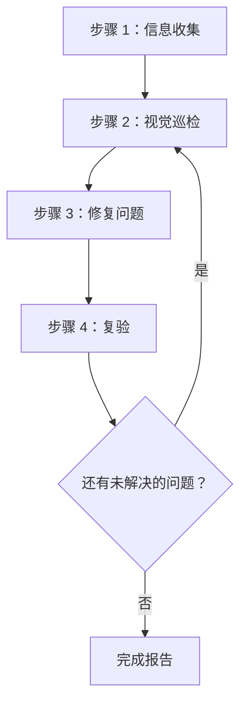
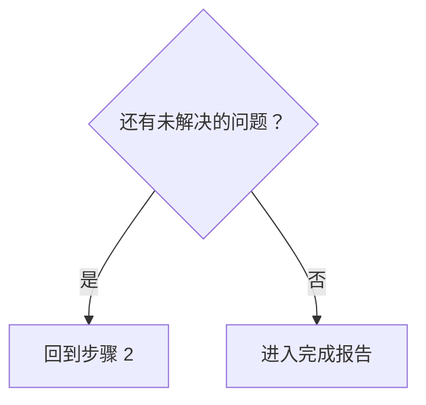

# 界面视觉巡检（Web Design Reviewer）

本技能用于对网站设计质量做视觉巡检与校验，并在源码层面定位并修复问题。

## 适用范围

- 静态站点（HTML/CSS/JS）
- React / Vue / Angular / Svelte 等 SPA 框架
- Next.js / Nuxt / SvelteKit 等全栈框架
- WordPress / Drupal 等 CMS 平台
- 其他任何 Web 应用

## 前提条件

### 必需

1. **目标网站必须正在运行**
   - 本地开发服务器（例如 `http://localhost:3000`）
   - 预发布环境
   - 生产环境（只做只读巡检时）

2. **必须具备浏览器自动化能力**
   - 截图
   - 页面导航
   - 获取 DOM 信息

3. **能访问源码（做修复时）**
   - 项目必须存在于当前工作区内

## 工作流概览



---

## 步骤 1：信息收集阶段

### 1.1 确认 URL

如果用户没有提供 URL，就问：

> 请提供要巡检的网站 URL（例如 `http://localhost:3000`）

### 1.2 了解项目结构

需要做修复时，收集以下信息：

| 项目 | 示例问法 |
|------|------------------|
| 框架 | 用的是 React / Vue / Next.js 还是别的？ |
| 样式方案 | CSS / SCSS / Tailwind / CSS-in-JS？ |
| 源码位置 | 样式文件与组件放在哪里？ |
| 巡检范围 | 只看特定页面，还是整个站点？ |

### 1.3 自动识别项目

尝试从工作区里的文件自动识别：

```
检测目标：
├── package.json     → 框架与依赖
├── tsconfig.json    → 是否使用 TypeScript
├── tailwind.config  → Tailwind CSS
├── next.config      → Next.js
├── vite.config      → Vite
├── nuxt.config      → Nuxt
└── src/ 或 app/     → 源码目录
```

### 1.4 判断样式方案

| 方案 | 识别特征 | 修改目标 |
|--------|-----------|-------------|
| 纯 CSS | `*.css` 文件 | 全局 CSS 或组件 CSS |
| SCSS/Sass | `*.scss`、`*.sass` | SCSS 文件 |
| CSS Modules | `*.module.css` | 模块 CSS 文件 |
| Tailwind CSS | `tailwind.config.*` | 组件里的 className |
| styled-components | 代码中出现 `styled.` | JS/TS 文件 |
| Emotion | 引入 `@emotion/` | JS/TS 文件 |
| 其他 CSS-in-JS | 内联样式 | JS/TS 文件 |

---

## 步骤 2：视觉巡检阶段

### 2.1 遍历页面

1. 导航到指定的 URL
2. 截图
3. 获取 DOM 结构／快照（如果可行）
4. 如果还有其它页面，沿导航逐个走一遍

### 2.2 巡检项

巡检时按 [references/visual-checklist.md](references/visual-checklist.md) 走一遍，修完之后复验时再走一遍。

#### 布局问题

| 问题 | 说明 | 严重度 |
|-------|-------------|----------|
| 元素溢出 | 内容从父元素或视口溢出 | 高 |
| 元素重叠 | 元素意外互相重叠 | 高 |
| 对齐问题 | 栅格或 flex 对齐有问题 | 中 |
| 间距不一致 | padding/margin 不一致 | 中 |
| 文字被裁切 | 长文本没有妥善处理 | 中 |

#### 响应式问题

| 问题 | 说明 | 严重度 |
|-------|-------------|----------|
| 不兼容移动端 | 小屏上布局垮掉 | 高 |
| 断点问题 | 屏幕尺寸变化时过渡不自然 | 中 |
| 触控目标 | 移动端按钮太小 | 中 |

#### 无障碍问题

| 问题 | 说明 | 严重度 |
|-------|-------------|----------|
| 对比度不足 | 文字与背景的对比度过低 | 高 |
| 没有焦点态 | 键盘导航时无法判断当前状态 | 高 |
| 缺少 alt 文本 | 图片没有替代文本 | 中 |

#### 视觉一致性

| 问题 | 说明 | 严重度 |
|-------|-------------|----------|
| 字体不一致 | 混用了多种字体族 | 中 |
| 颜色不一致 | 品牌色不统一 | 中 |
| 间距不一致 | 同类元素之间的间距不统一 | 低 |

### 2.3 视口测试（响应式）

在以下视口下测试：

| 名称 | 宽度 | 代表设备 |
|------|-------|----------------------|
| 移动端 | 375px | iPhone SE/12 mini |
| 平板 | 768px | iPad |
| 桌面 | 1280px | 标准 PC |
| 宽屏 | 1920px | 大尺寸显示器 |

---

## 步骤 3：修复阶段

### 3.1 问题优先级


### 3.2 定位源码文件

从有问题的元素反查源码文件：

1. **按选择器搜索**
   - 用类名或 ID 在代码库里搜索
   - 用 `grep_search` 找出样式定义

2. **按组件搜索**
   - 从元素文字或结构判断组件
   - 用 `semantic_search` 找相关文件

3. **按文件模式过滤**
   ```
   样式文件：src/**/*.css, styles/**/*
   组件：src/components/**/*
   页面：src/pages/**, app/**
   ```

### 3.3 实施修复

#### 框架相关的修复要点

详见 [references/framework-fixes.md](references/framework-fixes.md)。

#### 修复原则

1. **最小改动**：只做解决问题所必需的最小改动
2. **遵循既有模式**：沿用项目现有的代码风格
3. **避免破坏性变更**：当心不要影响到其它区域
4. **加注释**：在合适的地方加注释说明修复原因

---

## 步骤 4：复验阶段

### 4.1 修复后确认

1. 重新加载浏览器（或等开发服务器 HMR 生效）
2. 对修好的区域截图
3. 对比修复前后

### 4.2 回归测试

- 确认修复没有影响其它区域
- 确认响应式显示没有被弄坏

### 4.3 是否继续迭代



**迭代上限**：某个具体问题如果修了 3 次以上仍未解决，就去问用户

---

## 输出格式

### 巡检结果报告

```markdown
# Web 设计巡检结果

## 概要

| 项目 | 值 |
|------|-------|
| 目标 URL | {URL} |
| 框架 | {识别出的框架} |
| 样式方案 | {CSS / Tailwind / 等} |
| 测试过的视口 | 桌面、移动端 |
| 发现的问题数 | {N} |
| 已修复的问题数 | {M} |

## 发现的问题

### [P1] {问题标题}

- **页面**：{页面路径}
- **元素**：{选择器或描述}
- **问题**：{问题的详细说明}
- **修复的文件**：`{文件路径}`
- **修复内容**：{改动说明}
- **截图**：修复前／修复后

### [P2] {问题标题}
...

## 未修复的问题（如有）

### {问题标题}
- **原因**：{为什么没修／修不了}
- **建议动作**：{给用户的建议}

## 建议

- {后续可改进的方向}
```

---

## 所需能力

| 能力 | 说明 | 是否必需 |
|------------|-------------|----------|
| 网页导航 | 访问 URL、页面跳转 | ✅ |
| 截图 | 抓取页面图像 | ✅ |
| 图像分析 | 发现视觉问题 | ✅ |
| DOM 获取 | 取回页面结构 | 建议具备 |
| 文件读写 | 读取与编辑源码 | 做修复时必需 |
| 代码搜索 | 在项目内搜索代码 | 做修复时必需 |

---

## 参考实现

### 用 Playwright MCP 实现

推荐把 [Playwright MCP](https://github.com/microsoft/playwright-mcp) 作为本技能的参考实现。

| 能力 | Playwright MCP 工具 | 用途 |
|------------|---------------------|---------|
| 导航 | `browser_navigate` | 访问 URL |
| 快照 | `browser_snapshot` | 取回 DOM 结构 |
| 截图 | `browser_take_screenshot` | 提供视觉巡检用的图像 |
| 点击 | `browser_click` | 操作交互元素 |
| 调整窗口 | `browser_resize` | 做响应式测试 |
| 控制台 | `browser_console_messages` | 发现 JS 报错 |

#### 配置示例（MCP Server）

```json
{
  "mcpServers": {
    "playwright": {
      "command": "npx",
      "args": ["-y", "@playwright/mcp@latest", "--caps=vision"]
    }
  }
}
```

### 其它可用的浏览器自动化工具

| 工具 | 特点 |
|------|----------|
| Selenium | 浏览器支持广，多语言支持 |
| Puppeteer | 专注 Chrome/Chromium，Node.js |
| Cypress | 与 E2E 测试集成方便 |
| WebDriver BiDi | 标准化的新一代协议 |

同一套工作流也可以用这些工具实现。只要它们提供所需能力（导航、截图、DOM 获取），工具选择是灵活的。

---

## 最佳实践

### 应当做（推荐）

- ✅ 动手修复前一定先保存截图
- ✅ 一次只修一个问题并逐个验证
- ✅ 遵循项目现有的代码风格
- ✅ 大改动前先与用户确认
- ✅ 把修复细节记录完整

### 不应当做（不推荐）

- ❌ 未经确认就做大范围重构
- ❌ 无视设计系统或品牌规范
- ❌ 只顾修复、不管性能
- ❌ 一次修一堆问题（难以验证）

---

## 故障排查

### 问题：找不到样式文件

1. 检查 `package.json` 里的依赖
2. 考虑 CSS-in-JS 的可能性
3. 考虑样式是在构建时生成的
4. 问用户用的是哪种样式方案

### 问题：修复没有生效

1. 检查开发服务器的 HMR 是否正常工作
2. 清浏览器缓存
3. 项目需要构建时重新构建
4. 检查 CSS 优先级问题

### 问题：修复影响到了其它区域

1. 回滚改动
2. 使用更精确的选择器
3. 考虑改用 CSS Modules 或 scoped 样式
4. 与用户确认真实影响范围
