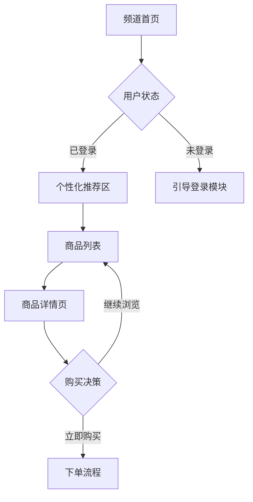

# 设计交付 —— Deliver

将设计方案转化为可落地的技术交付文档。

## 读取配置（自动生成，请勿删除）

执行任何动作前，读 `~/.qoderwork/plugins/config/super-design-studio/QODERWORK.md`。
- 文件不存在或仍含 `[PLACEHOLDER]` → 停下来，回复用户运行 `/super-design-studio:onboarding`，不要继续。
- 本 skill 会用到配置里的：## 命名规范、## 输出目录偏好、## 输出风格（设计稿交付格式、文档语气）、## 业务规则（设计规范引用路径）
- 配置没覆盖到的字段：反问用户 → 把答案写回 QODERWORK.md → 继续。不要在内存里假设默认值。

## 触发语

- "生成交付文件"
- "写交付文档"
- "交付给开发"
- "deliver [case-id]"

## 执行流程

### 1. 读取设计方案

1. 定位当前项目的 output/{case-id}/ 目录
2. 读取已有设计方案：
   - `generate/` 下的高保真 HTML 文件
   - `strategize/` 下的 DRD（设计需求文档）
   - `review/` 下的评审记录（如有）
3. 如果 output/ 目录为空或不存在，提示用户先完成 `generate` 步骤
4. 向用户确认本次交付范围：全部页面还是选定页面

### 2. 提取设计决策和交互链路

从 HTML 原型和 DRD 中提取：

**设计决策提取：**
- 布局结构（Flex/Grid 方案、响应式断点策略）
- 组件复用模式（哪些模块是相同组件的变体）
- 动效方案（CSS transition/animation 或 JS 动效）
- 状态管理方案（视觉状态切换逻辑）

**交互链路提取：**
- 用户动线：页面间的跳转关系
- 页面内交互：点击、滑动、展开等交互行为的目标和反馈
- 条件分支：不同用户状态（登录/未登录、有数据/空数据）下的界面差异
- 异常路径：加载失败、网络异常、数据为空等场景的降级方案

### 3. 生成交互链路图

使用 Mermaid 语法生成交互流程图：



同时生成可交互的 HTML 版本（使用 Mermaid.js 渲染）。

### 4. 生成页面详细说明

对每个页面/模块生成详细说明：

**模块划分：**
- 模块 ID 和命名（遵循 QODERWORK.md 命名规范）
- 模块功能描述
- 包含的子组件列表
- 与其他模块的依赖关系

**状态说明：**
- 默认状态（页面初始加载）
- 加载状态（骨架屏/Loading）
- 空状态（无数据时的展示）
- 错误状态（加载失败/网络异常）
- 边界状态（超长文本/极多数据/极端尺寸）

**异常处理：**
- 网络异常降级方案
- 图片加载失败占位
- 数据异常兜底展示
- 第三方服务不可用时的 fallback

### 5. 生成视觉标注

从 HTML/CSS 中自动提取视觉参数：

**颜色标注：**
- 提取所有使用的颜色值（HEX/RGB/HSL）
- 按用途分类：主色、辅助色、文本色、背景色、边框色、状态色
- 标注对比度是否达标（WCAG 4.5:1 / 3:1）

**字号标注：**
- 提取所有 font-size 值
- 标注排版层级（H1-H6、正文、辅助文本、标签）
- 行高和字间距

**间距标注：**
- 提取 margin/padding 值
- 标注间距系统（如 4px 基数网格）
- 模块间距 vs 模块内间距

**圆角/阴影/边框标注：**
- border-radius 值
- box-shadow 参数
- border 样式和颜色

**标注输出格式：**
- CSS Token 表格（变量名、值、用途、使用场景）
- 可视化标注图（在页面截图上叠加标注线）

### 6. 组装技术交付文档

将以上内容组装为完整交付文档：

**文档结构：**
```
1. 项目概览（项目背景、设计目标、版本信息）
2. 交互链路图（Mermaid 流程图 + 文字说明）
3. 页面详细说明（逐模块）
   3.1 模块划分
   3.2 状态说明
   3.3 异常处理
4. 视觉标注
   4.1 颜色 Token
   4.2 字号 Token
   4.3 间距 Token
   4.4 圆角/阴影 Token
5. 组件复用清单（可复用组件列表及使用场景）
6. 开发注意事项（性能、兼容性、动画实现建议）
7. 变更记录（从设计到交付的版本变更历史）
```

**输出格式：**
- HTML 版（可交互，Mermaid 图可点击展开）
- Markdown 版（纯文本，适合文档系统）

## 产出

- `output/{case-id}/deliver/delivery-report.html` — HTML 技术交付文档
- `output/{case-id}/deliver/delivery_report.md` — Markdown 技术交付文档
- `output/{case-id}/deliver/tokens.json` — 设计 Token JSON 文件
- `output/{case-id}/deliver/flow-diagram.mmd` — Mermaid 流程图源文件

## MCP 依赖

| MCP 工具 | 用途 | 未连接时 fallback |
|---|---|---|
| 钉钉文档 | 将交付文档推送到钉钉文档空间，方便开发团队查阅 | 本地生成 HTML/MD 文件，用户手动分享 |

### 钉钉文档推送
交付文档生成完成后：
- 如果钉钉文档 MCP 已连接（检查 QODERWORK.md `## 已连接的工具`），询问用户是否需要推送到钉钉文档空间
- 推送时保留文档格式和目录结构
- 推送后在产出中附带钉钉文档链接

## Pitfalls
- **不要凭空生成标注值** — 所有颜色、字号、间距值必须从实际 HTML/CSS 中提取，不要根据"常见做法"猜测数值。
- **不要遗漏异常状态** — 交付文档最常见的问题是只写了"正常路径"，必须覆盖空状态、错误状态、边界状态。
- **Mermaid 图要可渲染** — 生成的 Mermaid 语法必须通过渲染验证，避免语法错误导致开发无法查看。
- **Token 命名要遵循规范** — 如果 QODERWORK.md 中定义了命名规范（如 BEM 或设计系统 token 名），必须遵循。没有规范时使用语义化命名（如 --color-price-highlight 而非 --color-red-1）。
- **HTML 交付文档要自包含** — HTML 版交付文档应该是自包含的（内联 CSS/JS），不依赖外部资源，确保离线可查看。
- **不要混入设计建议** — 交付文档是"是什么"而非"应该是什么"。如果在提取过程中发现设计问题，单独列在"建议优化"段，不要混入正式标注。
