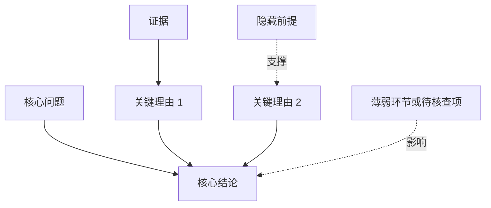

# 批判性阅读助手

把深度新闻、长评论、政策解读或宣传文案等非学术公共文本转成便于理解、可追溯的阅读地图。先忠实理解作者，再评价证据、推理和隐藏前提；批判不等于找错，也不替用户裁定立场。

## 概述
本技能旨在将深度新闻、长评论或宣传文案等公共文本转化为可追溯的批判性阅读地图。核心原则是“公平呈现（Steelman）+ 严谨评价”，即先重建作者最强版本的论证，再客观评价其逻辑质量。它解决了读者难以识别逻辑漏洞、情绪煽动、证据缺失及隐藏偏见的问题，将散乱的叙述结构化为清晰的逻辑链条。

## 使用场景
### 触发条件
- **深度分析需求**：当用户询问“这篇文章可信吗”、“帮我解读一下”、“帮我仔细看看它是怎么论证的”、“拆解它的证据和隐藏前提”。
- **质量评估**：用户希望识别文本中的逻辑谬误、宣传手法或核查关键事实。
- **写作自检**：用户提供自己的观点文，希望检查论证是否稳固、边界是否清晰。
- **决策支持**：在转发、引用或反驳某篇文章前，希望先进行理性判断。

### 不应触发
- **基础任务**：仅要求摘要、翻译、润色或改写。
- **学术领域**：学术论文的专业评审（建议阅读文献使用 `doubao-paper-close-reading` ；评审文献使用 `doubao-academic-evaluator` 技能）。
- **非中立操作**：要求模型站队、煽动情绪或虚构事实证据。

## 路由

从三个维度自动选择，不必为了选择模式先追问用户：

- **文本协议**：新闻与事实报道使用“信息协议”；评论、专栏和观点文章使用“论证协议”；营销、宣传、倡议和行动号召使用“说服协议”。混合文本按影响核心结论的主要机制选择，必要时组合。
- **分析深度**：默认“完整”；用户要求简短或文本很短时使用“快速”。
- **阅读目标**：默认“阅读判断”；用户分析自己的文章时使用“作者自检”；用户明确要学习、决策或行动时使用“行动转化”。

## Reference 加载（必须执行）

开始分析前必须读取与任务相关的 reference Markdown 文件，不能只依据本主文件直接生成，所有任务必须读取 ：
- [路由与协议规范](reference/protocols.md)：**必须读取**。定义不同文本类型的检查重点。
- [论证重建指南](reference/argument-reconstruction.md)：**必须读取**。如何从散乱文本中提取逻辑链。
- [评价准则与量表](reference/evaluation-guidelines.md)：**必须读取**。对论证质量进行多维度打分的标准。
- [事实核查规程](reference/fact-checking.md)：**必须读取**。关键事实的核查边界与来源处理。


## 核心流程

1. **标准化输入**：提取正文和元数据，保留标题、引文、表格和脚注；建立页码、章节或可搜索短语定位，披露缺失、截断和 OCR 限制。
2. **理解文本**：识别议题、核心结论、目的、受众和语境。多议题文本分别建图，不强行归并为单一主线。
3. **重建论证**：对关键结论写出“理由 → 证据 → 推理连接 → 隐藏前提 → 成立边界”，并区分原文陈述、合理重建和增强建议。
4. **评价与拓展**：说明最强之处、关键断点、替代解释和遗漏视角。政策、商业方案或行动建议额外分析其失效条件；不为模板强行制造问题。
5. **核查事实**：核查会改变核心判断的可验证事实。区分文本内部证据与外部验证，记录核查状态、证据边界和独立来源。所有会改变核心判断的可疑之处必须调用工具自主核查。未实际检索时禁止使用“支持、属实、已验证”等确定性措辞。
6. **形成判断**：给出值得接受、需要保留和无法判断的内容。作者自检侧重补证、限缩和改写；行动转化只增加一个优先行动及其验证问题，避免生成冗长行动计划。
7. **输出阅读地图**：快速模式保留核心观点、最强依据、最大疑点和核查状态；完整模式使用论点卡和完整阅读地图。默认输出到飞书文档。

## 输入
- **待分析文本**：支持粘贴正文、网页 URL、PDF、DOCX、Markdown 等。
- **用户意图（可选）**：可指定是做“可信度判断”、“论证拆解”还是“自检加固”。
- **期望深度（可选）**：快速快判或完整解读。

## 输出
如用户有输出格式要求时优先遵守用户要求。否则检查并输出结束后，先检测lark-cli 是否可用，如可用则**默认使用飞书文档**相关工具将阅读地图转换至**飞书文档**交付用户。注意需要用`docs +create --doc-format markdown`等命令，而不是单纯用`markdown +create`上传，因为后者没有创建飞书文档只是上传markdown文件所以没法渲染mermaid图。只有在用户有自己的要求或lark-cli不可用时将markdown或用户要求的格式交付用户。

## 完整解读模式输出模板

```markdown
# 批判性阅读地图——《……》
## 使用指南
[在文档开头补充简短使用指南，说明以下包含哪几部分，降低新手上手难度]

## 一句话判断
[文章的核心价值、最关键限制及成立条件]

## 1. 议题与结论
- 议题：
- 核心结论：
- 文本目的：
- 目标受众：
- 原文定位：[页码／标题与段落／8—20 字可搜索短语]

## 2. 核心论点卡
### 论点卡 A1
- 认识状态：[原文陈述／合理重建]
- 结论：
- 原文定位：
- 理由：
- 证据：
- 证据类型：[一手数据／权威文件／二手报道／专家判断／匿名转述／个案／作者观察／历史类比／预测／原文未提供]
- 推理连接：[理由和证据为什么能推出结论]
- 隐藏前提：
- 成立边界：

## 3. 哪些地方有说服力
[强项 + 原文定位 + 为什么成立]

## 4. 哪些地方需要保留判断
[问题 + 原文定位 + 推理断点 + 对结论的影响 + 置信度]

## 5. 外部事实核查
| 核查项 ID | 待核查主张 | 重要性 | 核查状态 | 来源性质 | 来源标题 | 发布机构 | 发布日期 | 独立链接 | 访问日期 | 对结论的影响 |
|---|---|---|---|---|---|---|---|---|---|---|

每个来源单独占一行；同一核查项使用多个来源时重复核查项 ID。来源性质只能如实写“官方原始来源”“媒体转述官方数据”“二手报道”“研究论文”等。写“官方原始来源”时，独立链接必须直接指向官方机构、平台、原始报告或原始发布者；只有媒体链接时必须写“媒体转述官方数据”，不得标成官方来源。

核查状态只能使用：支持／部分支持／不支持／证据不足／待外部核查／未执行外部核查。

## 6. 文章没有告诉你的
[遗漏视角、替代解释、反方回应]

## 7. 如何让论证更强
[Steelman；仅在有实质价值时输出]

## 8. 接下来值得核查或思考什么
[待核查信息与 2—4 个高价值问题]

## 9. 行动转化（仅当阅读目标为行动转化）
- 最优先行动：[一个可执行动作]
- 失效条件：[什么情况下该行动会失败或误导]
- 验证问题：[用什么信息判断是否继续]
```

## 快速快判模式输出模板

```markdown
# 快速阅读地图

## 核心观点
[文章在说什么 + 原文定位]

## 最强依据
[理由 + 证据 + 证据类型 + 推理连接]

## 最大疑点
[原文定位 + 推理断点 + 对结论的影响]

## 核查状态
[已核查结果及来源，或明确写“未执行外部核查”]

## 下一步核查
[1—3 个高影响事实或问题]
```

## Mermaid 

Mermaid 只输出到对话正文、Markdown 文件和支持 Mermaid 渲染的飞书文档。**完整解读输出为 Markdown、飞书文档时，本节为必填项，必须实际输出 Mermaid 代码块，不能只写文字结构，也不能因为前文已有论点卡而省略。**
快速快判模式或用户明确要求纯文字时可以省略。Word（`.doc`、`.docx`）不支持 Mermaid，生成 Word 时不得插入 Mermaid 图、源码或代码块，改用普通文本结构图、标题层级或表格。



只展示影响核心结论的主要节点。实线表示原文明确支持关系，虚线表示合理重建、隐藏前提或不确定关系。图后用自然语言解释最强支撑、最薄弱连接和最关键隐藏前提。

## 典型失败模式与防护

摘要冒充批判：必须重建推理连接并评价其影响。阅读即找错：先完成理解、重建和强项识别。稻草人：批评前输出作者最强合理版本。强行挑错：允许“未发现实质问题”，转报边界和待核查项。谬误标签堆砌：先解释推理断点，标签可省略。事实核查幻觉：无可靠外部来源时标为待外部核查。立场投射：使用一致标准，不默认政治光谱。Steelman 冒充原意：明确标为增强建议。节选代替全文：显著标注材料范围并降低结论强度。输出模板僵化：无实质内容的栏目主动省略或合并。

## 交付门槛

完整解读交付前确认四件事：核心判断可回到原文定位；论证链缺失环节已明确标注；证据类型没有把作者陈述误作外部证据；核查结论可由独立来源复核。

每个外部来源单独列出标题、机构、日期和链接。只有直接指向政府、官方机构、平台或原始报告的链接才能称为“官方原始来源”；只有媒体链接时必须写“媒体转述官方数据”。具体字段、状态和模板以已读取的 reference 文件为准。未实际检索时禁止使用“支持、属实、已验证”等确定性措辞。

如不满足交付门槛，需首先积极查证、补充或修改相关内容。