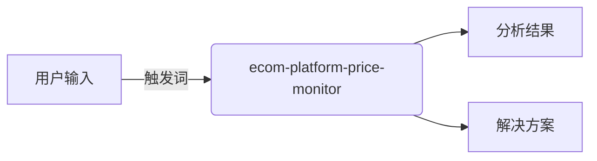

# ecom-platform-price-monitor

> ecom-platform-price-monitor 是一个专业的 电商价格监控与竞争情报工具，监控Amazon、eBay、AliExpress等平台价格变化，支持预警、历史追踪和重定价数据输出。，帮助用户快速完成相关任务并输出标准化交付物。

## 触发条件

当用户输入包含以下关键词时自动加载：

```
ecom, platform, price, monitor
```

## 功能定位

ecom-platform-price-monitor 是一个专业的 电商价格监控与竞争情报工具，监控Amazon、eBay、AliExpress等平台价格变化，支持预警、历史追踪和重定价数据输出。，帮助用户快速完成相关任务并输出标准化交付物。

## 输入

| 字段 | 说明 | 示例 |
|------|------|------|
| 任务描述 | 用户的具体需求或问题描述 | 我需要分析竞品SEO策略 |
| 上下文信息 | 相关背景数据、约束条件、业务场景 | 北美市场、母婴品类、Q4旺季 |
| 质量标准 | 输出要求、验收标准、格式规范 | Markdown格式、包含数据支撑 |
| 目标受众 | 最终使用者或决策者 | 运营团队、管理层、外部客户 |
| 时间约束 | 交付时限、迭代周期 | 即时/24小时/周度 |

## 输出

| 字段 | 说明 | 格式 |
|------|------|------|
| 分析结果 | 结构化的问题分析或洞察 | Markdown/表格/图表 |
| 解决方案 | 可执行的策略或方案 | 步骤清单/流程图 |
| 执行指南 | 具体的操作步骤和注意事项 | 编号列表/检查清单 |
| 风险提示 | 潜在问题和规避建议 | 高/中/低分级 |
| 关联建议 | 下一步行动或相关skill推荐 | skill名称+触发条件 |

## 执行步骤

1. **需求解析**：理解用户输入，提取关键约束和目标
2. **信息收集**：检索相关数据、知识库、历史案例
3. **分析处理**：应用专业方法论进行深度分析
4. **方案生成**：输出结构化结果，包含多选项（如适用）
5. **质量检查**：验证完整性、准确性、格式规范性

## 质量检查

- [ ] 输出是否覆盖用户所有明确需求
- [ ] 数据/事实是否准确且有来源支撑
- [ ] 格式是否符合标准规范
- [ ] 是否包含可执行的下一步建议
- [ ] 语言是否符合目标受众专业水平

## 使用场景

### 场景1: 基础使用
用户直接输入触发词，系统自动加载本skill，按照标准流程完成任务。

### 场景2: 联动工作流

ecom-platform-price-monitor 属于 **电商运营** 域（e-commerce operations for Momcozy），可与其他 skill 形成工作流链路：

- 可与同域skill组合使用

## 一句话调用

```
使用 ecom-platform-price-monitor 帮我下一步行动或相关skill推荐...
```


## 关联技能

- **hermes-team**: 多任务并行执行
- **hermes-ultrawork**: 批量处理支持

## 后续改良方向

1. 增加更多实战案例和最佳实践
2. 细化行业/场景特定的评估标准
3. 添加自动化质量检查工具集成
4. 扩展多语言支持和本地化适配
5. 建立用户反馈循环，持续优化输出质量


## Skill Graph



## 版本历史

| 版本 | 日期 | 变更内容 |
|------|------|----------|
| 1.0.0 | 2025-01 | 初始版本 |
| 2.0.0 | 2025-01 | 深度优化：标准结构、质量检查、Skill Graph |
